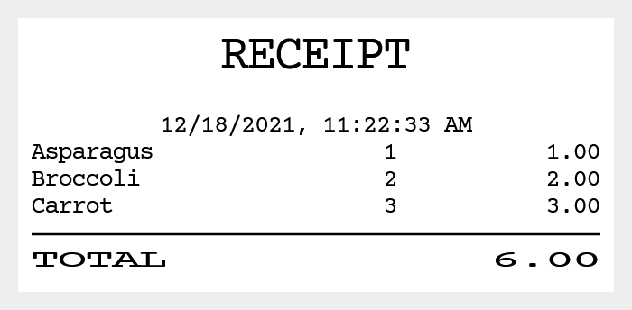

# ReceiptIO

A print application for receipt printers, simple and easy with markdown, printer status support.  

```bash
$ more receiptmd.receipt
^^^RECEIPT

12/18/2021, 11:22:33 AM
Asparagus | 1| 1.00
Broccoli  | 2| 2.00
Carrot    | 3| 3.00
---
^TOTAL | ^6.00

$ receiptio -d 192.168.192.168 -p escpos -c 42 receiptmd.receipt
success
```

```javascript
const receiptio = require('receiptio');

const receiptmd = `^^^RECEIPT

12/18/2021, 11:22:33 AM
Asparagus | 1| 1.00
Broccoli  | 2| 2.00
Carrot    | 3| 3.00
---
^TOTAL | ^6.00`;

receiptio.print(receiptmd, '-d 192.168.192.168 -p escpos -c 42').then(result => {
    console.log(result);
});
```

  

# Features

ReceiptIO is a simple print application for receipt printers that prints with easy markdown data for receipts and returns printer status. Even without a printer, it can output images.  

A development tool is provided to edit and preview the receipt markdown.  
https://receiptline.github.io/designer/  

The details of the receipt markdown are explained at  
https://github.com/receiptline/receiptline  

# Receipt Printers

- Epson TM series
- Seiko Instruments RP series
- Star MC series
- Citizen CT series
- Fujitsu FP series

Connect with IP address, serial port, or Linux USB device file.  
(LAN, Bluetooth SPP, USB with virtual serial port driver, ...)  

Epson TM series (South Asia model) and Star MC series (StarPRNT model) can print with device font of Thai characters.  

# Installation

```bash
$ npm install -g receiptio
```

For USB connections on Linux, add a user to the `lp` group and reboot to access the device file.  

```bash
$ sudo gpasswd -a USER lp
```

If serial port is used, [Node SerialPort](https://www.npmjs.com/package/serialport) is also required.  

```bash
$ npm install -g serialport
```

When using `-i` (print as image) or `-p png` (convert to png) option, [puppeteer](https://www.npmjs.com/package/puppeteer) or [sharp](https://www.npmjs.com/package/sharp) is also required.  

```bash
$ npm install -g puppeteer
```

```bash
$ npm install -g sharp
```

[sharp](https://www.npmjs.com/package/sharp) is not support web fonts and minimizes the area of "invert" character decoration.  

# Usage

```console
$ receiptio -h

usage: receiptio [options] [source]
source:
  receipt markdown text file
  https://receiptline.github.io/designer/
  if source is not found, standard input
options:
  -h                show help
  -d <destination>  ip address or serial/usb port of target printer
  -o <outfile>      file to output (if -d option is not found)
                    if -d and -o are not found, standard output
  -p <printer>      printer control language
                    (default: escpos if -d option is found, svg otherwise)
                    (escpos, epson, sii, citizen, fit, impact, impactb, generic,
                     star, starline, emustarline, stargraphic,
                     starimpact, starimpact2, starimpact3, svg, png, text)
                    (png requires puppeteer or sharp)
  -q                check printer status without printing
  -c <chars>        characters per line (24-96) (default: 48)
  -u                upside down
  -v                landscape orientation (for escpos, epson, sii, citizen, star)
  -r <dpi>          print resolution for -v (180, 203) (default: 203)
  -s                paper saving (reduce line spacing)
  -n                no paper cut
  -m [<l>][,<r>]    print margin (left: 0-24, right: 0-24) (default: 0,0)
  -i                print as image (requires puppeteer or sharp)
  -b <threshold>    image thresholding (0-255)
  -g <gamma>        image gamma correction (0.1-10.0) (default: 1.8)
  -t <timeout>      print timeout (0-3600 sec) (default: 300)
  -l <language>     language of source file (default: system locale)
                    (en, fr, de, es, po, it, ru, ja, ko, zh-hans, zh-hant, th, ...)
print results:
  success(0), online(100), coveropen(101), paperempty(102),
  error(103), offline(104), disconnect(105), timeout(106)
examples:
  receiptio -d COM1 receiptmd.receipt
  receiptio -d /dev/usb/lp0 receiptmd.receipt
  receiptio -d /dev/ttyS0 -u -b 160 receiptmd.receipt
  receiptio -d 192.168.192.168 -p escpos -c 42 receiptmd.receipt
  receiptio -d com9 -p impact -q
  receiptio receiptmd.receipt -o receipt.svg
  receiptio receiptmd.receipt -p escpos -i -b 128 -g 1.0 -o receipt.prn
  receiptio < receiptmd.receipt -p png > receipt.png
  echo {c:1234567890} | receiptio | more
```

## Command

`receiptio [options] [source]`  

## Parameters

- Input
  - `source`: receipt markdown text file
    - https://receiptline.github.io/designer/
  - if source is not found, standard input
- Output
  - `-d <destination>`: ip address or serial/usb port of target printer
  - `-o <outfile>`: file to output (if -d option is not found)
  - if -d and -o are not found, standard output
- Printer
  - `-p <printer>`: printer control language
    - `escpos`: ESC/POS
    - `epson`: ESC/POS (Epson)
    - `sii`: ESC/POS (Seiko Instruments)
    - `citizen`: ESC/POS (Citizen)
    - `fit`: ESC/POS (Fujitsu)
    - `impact`: ESC/POS (TM-U220)
    - `impactb`: ESC/POS (TM-U220 Font B)
    - `generic`: ESC/POS (Generic) _Experimental_
    - `star`: StarPRNT
    - `starline`: Star Line Mode
    - `emustarline`: Command Emulator Star Line Mode
    - `stargraphic`: Star Graphic Mode
    - `starimpact`: Star Mode on dot impact printers _Experimental_
    - `starimpact2`: Star Mode on dot impact printers (Font 5x9 2P-1) _Experimental_
    - `starimpact3`: Star Mode on dot impact printers (Font 5x9 3P-1) _Experimental_
    - `svg`: SVG
    - `png`: PNG (requires puppeteer or sharp)
    - `text`: plain text
    - default: `escpos` (with `-d` option) `svg` (without `-d` option)
  - `-q`: check printer status without printing
- Width
  - `-c <chars>`: characters per line
    - range: `24`-`96`
    - default: `48`
- Orientation
  - `-u`: upside down
  - `-v`: landscape orientation (for `escpos`, `epson`, `sii`, `citizen`, `star`)
  - `-r <dpi>`: print resolution for `-v`
    - values: `180`, `203`
    - default: `203`
- Paper
  - `-s`: paper saving (reduce line spacing)
  - `-n`: no paper cut
  - `-m [<left>][,<right>]`: print margin
    - range (left): `0`-`24`
    - range (right): `0`-`24`
    - default: `0,0`
- Image
  - `-i`: print as image (requires puppeteer or sharp)
  - `-b <threshold>`: image thresholding
    - range: `0`-`255`
  - `-g <gamma>`: image gamma correction
    - range: `0.1`-`10.0`
    - default: `1.8`
- Others
  - `-t <timeout>`: print timeout (sec)
    - range: `0`-`3600`
    - default: `300`
  - `-l <language>`: language of receipt markdown text
    - `en`, `fr`, `de`, `es`, `po`, `it`, `ru`, ...: Multilingual (cp437, 852, 858, 866, 1252 characters)
    - `ja`: Japanese (shiftjis characters)
    - `ko`: Korean (ksc5601 characters)
    - `zh-hans`: Simplified Chinese (gb18030 characters)
    - `zh-hant`: Traditional Chinese (big5 characters)
    - `th`: Thai
    - default: system locale

## Return value

- With `-d` option
  - `success(0)`: printing success
  - `online(100)`: printer is online
  - `coveropen(101)`: printer cover is open
  - `paperempty(102)`: no receipt paper
  - `error(103)`: printer error (except cover open and paper empty)
  - `offline(104)`: printer is off or offline
  - `disconnect(105)`: printer is not connected
  - `timeout(106)`: print timeout
- Without `-d` option
  - printer commands or images

# API

## Print (Convert) API

```javascript
// async/await
const result = await receiptio.print(receiptmd, options);
console.log(result);

// promise
receiptio.print(receiptmd, options).then(result => {
    console.log(result);
});
```

### Method

`receiptio.print(receiptmd[, options])`  

### Parameters

- `receiptmd` &lt;string&gt;
  - receipt markdown text
    - https://receiptline.github.io/designer/
- `options` &lt;string&gt;
  - `-d <destination>`: ip address or serial/usb port of target printer
    - Without `-d` option, the destination is the return value
  - `-p <printer>`: printer control language
    - `escpos`: ESC/POS
    - `epson`: ESC/POS (Epson)
    - `sii`: ESC/POS (Seiko Instruments)
    - `citizen`: ESC/POS (Citizen)
    - `fit`: ESC/POS (Fujitsu)
    - `impact`: ESC/POS (TM-U220)
    - `impactb`: ESC/POS (TM-U220 Font B)
    - `generic`: ESC/POS (Generic) _Experimental_
    - `star`: StarPRNT
    - `starline`: Star Line Mode
    - `emustarline`: Command Emulator Star Line Mode
    - `stargraphic`: Star Graphic Mode
    - `starimpact`: Star Mode on dot impact printers _Experimental_
    - `starimpact2`: Star Mode on dot impact printers (Font 5x9 2P-1) _Experimental_
    - `starimpact3`: Star Mode on dot impact printers (Font 5x9 3P-1) _Experimental_
    - `svg`: SVG
    - `png`: PNG (requires puppeteer or sharp)
    - `text`: plain text
    - default: `escpos` (with `-d` option) `svg` (without `-d` option)
  - `-q`: check printer status without printing
  - `-c <chars>`: characters per line
    - range: `24`-`96`
    - default: `48`
  - `-m [<left>][,<right>]`: print margin
    - range (left): `0`-`24`
    - range (right): `0`-`24`
    - default: `0,0`
  - `-u`: upside down
  - `-v`: landscape orientation (for `escpos`, `epson`, `sii`, `citizen`, `star`)
  - `-r <dpi>`:print resolution for `-v`
    - values: `180`, `203`
    - default: `203`
  - `-s`: paper saving (reduce line spacing)
  - `-n`: no paper cut
  - `-i`: print as image (requires puppeteer or sharp)
  - `-b <threshold>`: image thresholding
    - range: `0`-`255`
  - `-g <gamma>`: image gamma correction
    - range: `0.1`-`10.0`
    - default: `1.8`
  - `-t <timeout>`: print timeout (sec)
    - range: `0`-`3600`
    - default: `300`
  - `-l <language>`: language of receipt markdown text
    - `en`, `fr`, `de`, `es`, `po`, `it`, `ru`, ...: Multilingual (cp437, 852, 858, 866, 1252 characters)
    - `ja`: Japanese (shiftjis characters)
    - `ko`: Korean (ksc5601 characters)
    - `zh-hans`: Simplified Chinese (gb18030 characters)
    - `zh-hant`: Traditional Chinese (big5 characters)
    - `th`: Thai
    - default: system locale

### Return value

- With `-d` option &lt;string&gt;
  - `success`: printing success
  - `online`: printer is online
  - `coveropen`: printer cover is open
  - `paperempty`: no receipt paper
  - `error`: printer error (except cover open and paper empty)
  - `offline`: printer is off or offline
  - `disconnect`: printer is not connected
  - `timeout`: print timeout
- Without `-d` option &lt;string&gt;
  - printer commands or images

## Transform stream API

`receiptio.createPrint()` method is the stream version of the `receiptio.print()`.  

```javascript
const fs = require('fs');
const receiptio = require('receiptio');

const source = fs.createReadStream('example.receipt');
const transform = receiptio.createPrint('-p svg');
const destination = fs.createWriteStream('example.svg');

source.pipe(transform).pipe(destination);
```

### Method

`receiptio.createPrint([options])`  

### Parameters

- `options` &lt;string&gt;

### Return value

- Transform stream &lt;stream.Transform&gt;

# Serial port options

```
-d COM1:115200,N,8,1
```

- `-d <destination>`
  - the system path of the serial port
  - `<system path>[:<options>]`
- `<options>`
  - `<baud rate>,<parity>,<data bits>,<stop bits>[,<flow control>]`
  - default: `115200,N,8,1,N`
  - commas can be omitted
- `<baud rate>`
  - `2400`, `4800`, `9600`, `19200`, `38400`, `57600`, `115200`
- `<parity>`
  - `N`: none, `E`: even, `O`: odd
- `<data bits>`
  - `8`, `7`
- `<stop bits>`
  - `1`, `2`
- `<flow control>`
  - `N`: none, `R`: rts/cts, `X`: xon/xoff

# License

- ReceiptIO
  - Apache License, Version 2.0
- QR Code Generator for JavaScript with UTF8 Support
  - MIT License
